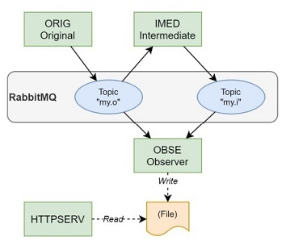

# DevOps-AMQP Exercise
###### Continuous Development and Deployment (COMP.SE.140) exercise
[2020-10-31] Document version 1.0 - H292287 Markus Palomäki

[📄 This file is available as PDF here.](./documents/documentation.pdf)

### Exercise Description and Requirements

[*Original assigment description document*](documents/AMQP_Exercise_v6_tarkennus.pdf)

In this exercise a student had to create multiple applications which uses
[RabbitMQ](https://www.rabbitmq.com/) to route messages from application to other
with message-queues and topics. The services run on Docker containers.

The learning goals were to learn basics of message-queues and topic-based communication
with RabbitMQ, and how to implement topic-based publish-subscribe communication
for message routing. Also, how to build a complex systems with Docker and learn
how to use volumes in Docker Compose.

### Implementation

Every application/server (except RabbitMQ) runs on Node.js containers. These application
has own server which includes needed files for Docker Compose and other information
such as `package.json` to install required `npm` packages. The only package which
applications uses is `amqplib` node client library. This was selected from other available
clients because the RabbitMQ used it in their tutorials.



*The implemented network*

RabbitMQ uses two topics for message routings, *my.o* and *my.i*.

`ORIG` application publishes three messages to *my.o* every three seconds.
Application `IMED` listens the topic *my.o* and sends a new message after waiting
one second to topic *my.i*. Application `OBSE` listens all RabbitMQ topics, and
writes every received message into file.

After sending all three messages `ORIG` will shutdown itself. It can be run again
to send new three messages.

`OBSE` recreates the file `output` if application couldn't find it. The application
stores the file into shared volume `data_output`, which is shared with application
`HTTPSERV`. If `OBSE` is restarted, the file will be cleared.

When Docker Compose will be launched, every container starts at the same time.
Because RabbitMQ takes some time to fully launch, other applications can't connect
to it so the applications will crash. Because of this, the containers will restart
automatically with properties of `docker-compose.yml`. Containers will restart
max 10 times before closing. With this, RabbitMQ will be working fully before sending
the first message.

If one of the containers are rebuilt, with `depends_on` values it will restart other
necessary containers.

As materials I mostly used [RabbitMQ's tutorials](https://www.rabbitmq.com/tutorials/tutorial-one-javascript.html).

### How-To

```terminal
$ git clone <url>
$ docker-compose up --build -d
```

After the setup is completed (~30 seconds), the result should be visible:
```terminal
$ curl localhost:8080
  % Total    % Received % Xferd  Average Speed   Time    Time     Time  Current
                                 Dload  Upload   Total   Spent    Left  Speed
100   270    0   270    0     0  33750      0 --:--:-- --:--:-- --:--:-- 38571
2020-10-31T17:12:58.831Z Topic: my.o MSG_1
2020-10-31T17:12:59.843Z Topic: my.i Got MSG_1
2020-10-31T17:13:01.839Z Topic: my.o MSG_2
2020-10-31T17:13:02.845Z Topic: my.i Got MSG_2
2020-10-31T17:13:04.837Z Topic: my.o MSG_3
2020-10-31T17:13:05.841Z Topic: my.i Got MSG_3

```

or on website `http://localhost:8080`:
```html
2020-10-31T17:12:58.831Z Topic: my.o MSG_1
2020-10-31T17:12:59.843Z Topic: my.i Got MSG_1
2020-10-31T17:13:01.839Z Topic: my.o MSG_2
2020-10-31T17:13:02.845Z Topic: my.i Got MSG_2
2020-10-31T17:13:04.837Z Topic: my.o MSG_3
2020-10-31T17:13:05.841Z Topic: my.i Got MSG_3
```

### Conclusions

RabbitMQ is a great "out of the box" tool to deliver messages without needing to worry about
the actual delivery. Compared to HTTP *request-response* AMQP is
asynchronous and easy to maintain, but messages can't be sent or received without a broker.
HTTP doesn't have this problem. Also, while doing the exercise I noticed how easy it was to set-up
RabbitMQ for the applications without any configurations; with AMQP library `amqplib`
it was easy to connect applications.

The hardest part was the coding itself and not the actual RabbitMQ. The basic coding problems
such as wait timings between sending messages took time to solve because lack of code experience in
JavaScript language.

The project was hard to start because it included so many levels and
steps to complete. Also, Covid-19 restrictions which affects to studying, and also
other university projects, postponed this project. What I've especially learned while this project
and also on this Fall so far, I prefer more studying in campus area than distance studying in a small
studio flat where are too much distraction factors.

Even I was nervous and a little bit anguished about the project and about how it
got postponed again and again, I was able to solve problems and finish it in the last week.
After all the exercise was a nice small project to work, and I'm happy because I
succeeded to solve the exercise after the challenges of the beginning.
